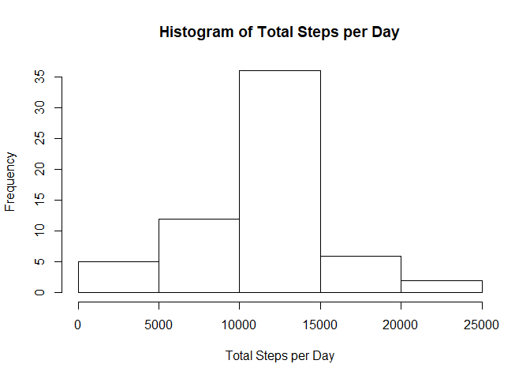
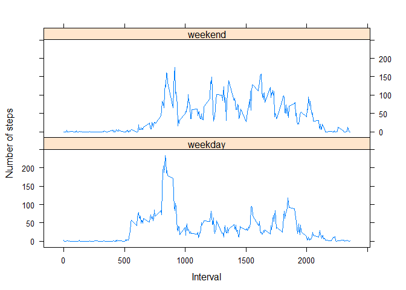

# Reproducible Research: Peer Assessment 1


## Loading and preprocessing the data

```r
library(data.table)
if(!file.exists("activity.csv")){
	unzip("activity.zip")	
}

data <- fread("activity.csv",
			  colClasses = c("numeric",
			  			   "Date",
			  			   "numeric"))
```


## What is mean total number of steps taken per day?
1. Total number of steps taken per day

```r
dataWithNA <- data # raw data cleaned
data <- data[complete.cases(data$steps), ] # cleaned
stepsPerDay <- data[, .(steps = sum(steps)), by = date]
```

2. Let's create a histogram of total steps per day

```r
# barplot(stepsPerDay$steps)
with(stepsPerDay,
	 hist(steps,
	 	 main = "Total Steps per Day",
	 	 xlab = "Steps"))
```

<!-- -->

3. Let's calculate the mean and median of the steps taken per day.

```r
meanStepsPerDay <- stepsPerDay[, mean(steps)]
medianStepsPerDay <- stepsPerDay[, median(steps)]
```
The mean value of total steps per day is 10766.19 and the median is 10765.


## What is the average daily activity pattern?
1. The graph of, 5-minute intervals and the averages of steps taken, averaged across all days.

```r
intervalAverages <- data[, .(steps = mean(steps)), by = interval]
intervalAverages <-  intervalAverages[order(interval)]
with(intervalAverages,
	 plot(interval, steps,
	 type = "l",
	 xlab = "interval",
	 ylab = "average steps"))
```

<!-- -->

2. Find the interval that has maximum average number of steps.

```r
maxStepsForInterval <- intervalAverages[order(-steps)][1]
```
Maximum average number of steps for 5 minute interval is 206.1698113 and that is for interval 835.


## Imputing missing values
1. Let's get total number of missing values in the dataset.

```r
totalMissing <- dataWithNA[is.na(steps), .N]
```
There are total of 2304 missing values.

2. Let's fill all the missing steps with of 5 minute mean, by merging two data tables with keys and replacing `NA` values with corresponding row.

```r
dataWithNA <- setkey(as.data.table(dataWithNA), interval)
intervalAverages <- setkey(as.data.table(intervalAverages), interval)

naRemoved <- merge(dataWithNA, intervalAverages) # merging two data tables with key
```

3. New dataset with `NA` values replaced with averages.

```r
naRemoved$steps.x[is.na(naRemoved$steps.x)] <- naRemoved$steps.y[is.na(naRemoved$steps.x)] # filling NA values
naRemoved <- naRemoved[ , !("steps.y")]
```

4. New histogram of total number of steps taken each day.

```r
totalStepsPerDay <- naRemoved[, .(steps = sum(steps.x)),
							  by = date]
hist(totalStepsPerDay$steps,
	 main = "Histogram of Total Steps per Day",
	 xlab = "Total Steps per Day")
```

<!-- -->

```r
totalMeanStepsPerDay <- totalStepsPerDay[, mean(steps)]
totalMedianStepsPerDay <- totalStepsPerDay[, median(steps)]
```

The mean value of total steps per day is 10766.19 and the median is 10766.19. THe differences from previous values are 0 and 1.188679. We can see that the median has changed after replacing the `NA` values with averages.


## Are there differences in activity patterns between weekdays and weekends?
1. Creating new column as `data_type` in `dataWithNA` table.

```r
dataWithNA$date_type <- naRemoved[, .(date_type = ifelse(weekdays(as.Date(date)) 
														 == "Sunday" 
														 | weekdays(as.Date(date)) 
														 == "Saturday",
														 "weekend",
														 "weekday"))]
```

2. Making the plot.

```r
library(lattice)
avgStpByDateType <- dataWithNA[, .(avg_steps
								   = mean(steps, na.rm = TRUE)),
							  by = .(date_type, interval)]

xyplot(avg_steps ~ interval | date_type,
	   data = avgStpByDateType,
	   type = "l",
	   xlab = "Interval",
	   ylab = "Number of steps",
	   layout = c(1,2))
```

<!-- -->
