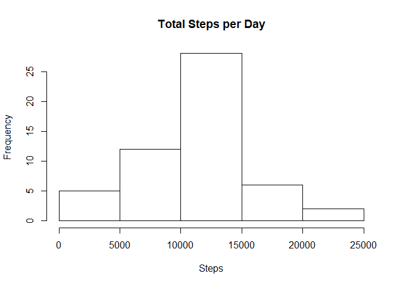

# Reproducible Research: Peer Assessment 1


## Loading and preprocessing the data

```r
if(!file.exists("activity.csv")){
	unzip("activity.zip")	
}

library(data.table)
data <- read.csv("activity.csv",
				 colClasses = c("numeric",
				 			    "Date",
				 			    "numeric"))
```


## What is mean total number of steps taken per day?
1. Total number of steps taken per day

```r
dataWithNA <- data # raw data cleaned
data <- data[complete.cases(data$steps), ] # cleaned
stepsPerDay <- aggregate(steps ~ date, data, sum)
```

2. Let's create a histogram of total steps per day

```r
# barplot(stepsPerDay$steps)
hist(stepsPerDay$steps,
	 main = "Total Steps per Day",
	 xlab = "Steps")
```

<!-- -->

3. Let's calculate the mean and median of the steps taken per day.

```r
meanStepsPerDay <- mean(stepsPerDay$steps)
medianStepsPerDay <- median(stepsPerDay$steps)
```
The mean value of total steps per day is 10766.19 and the median is 10765.


## What is the average daily activity pattern?
The graph of, 5-minute intervals and the averages of steps taken, averaged across all days.

```r
intervalAverages <- aggregate(steps ~ interval, data, mean)
intervalAverages <-  intervalAverages[order(intervalAverages$interval), ]
plot(intervalAverages$interval, intervalAverages$steps,
	 type = "l",
	 xlab = "interval",
	 ylab = "average steps")
```

<!-- -->


## Imputing missing values
1. Let's get total number of missing values in the dataset.

```r
totalMissing <- sum(is.na(dataWithNA$steps))
```
There are total of 2304 missing values.

2. Let's fill all the missing steps with of 5 minute mean, by merging two data tables with keys and replacing `NA` values with corresponding row.

```r
dataWithNA <- setkey(as.data.table(dataWithNA), interval)
intervalAverages <- setkey(as.data.table(intervalAverages), interval)

naRemoved <- merge(dataWithNA, intervalAverages) # merging two data tables with key
```

3. New dataset with `NA` values replaced with averages.

```r
naRemoved$steps.x[is.na(naRemoved$steps.x)] <- naRemoved$steps.y[is.na(naRemoved$steps.x)] # filling NA values
naRemoved <- naRemoved[ , !("steps.y")]
```

4. New histogram of total number of steps taken each day.

```r
totalStepsPerDay <- aggregate(steps.x ~ date, naRemoved, sum)
hist(totalStepsPerDay$steps,
	 main = "Histogram of Total Steps per Day",
	 xlab = "Total Steps per Day"
	 )
```

<!-- -->

```r
totalMeanStepsPerDay <- mean(totalStepsPerDay$steps)
totalMedianStepsPerDay <- median(totalStepsPerDay$steps)
```

The mean value of total steps per day is 10766.19 and the median is 10766.19. THe differences from previous values are 0 and 1.188679.


## Are there differences in activity patterns between weekdays and weekends?
